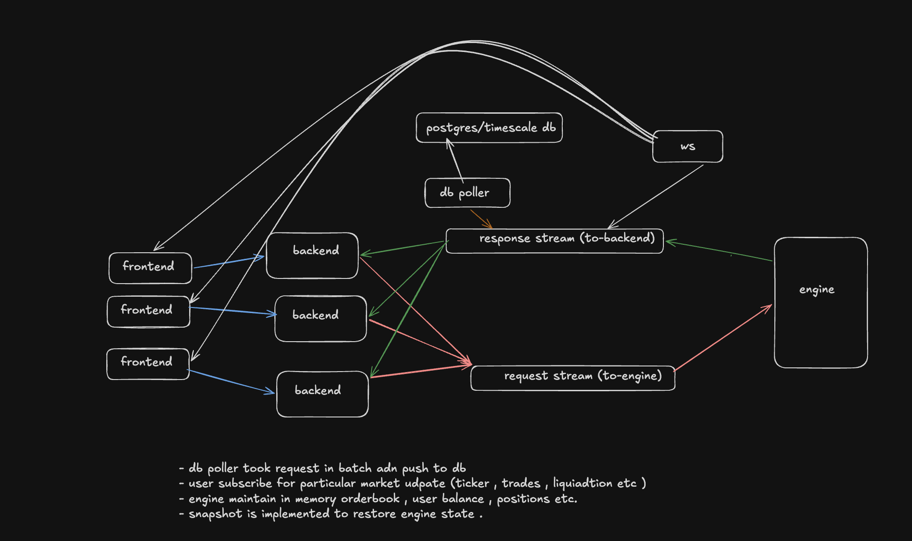

# Axiom



A study implementation of a perpetual cryptocurrency exchange. This is a personal project built to explore the mechanics of order matching, real-time market data streaming, and asynchronous trade persistence.

**Status:** Personal project / Prototype. Not a production trading system.

## Features

- **Matching Engine**: Custom in-memory matching logic for orders (`apps/engine`).
- **Real-Time Data**: WebSocket server for streaming price ticks and order book updates (`apps/ws`).
- **Persistence Pipeline**: Asynchronous database consumer that writes trades and order states to Postgres (`apps/db`).
- **Automated Liquidity**: A built-in market maker script to populate the order book (`apps/market-maker`).
- **Frontend Interface**: A Next.js trading UI using Tailwind CSS v4 and Lightweight Charts (`apps/frontend`).

## Architecture

This project is structured as a Bun/Turborepo monorepo with several microservices communicating via Redis streams and a shared Postgres database.

- **`apps/engine`**: The core matching engine. Reads order requests, matches them in memory, and publishes trade events to Redis.
- **`apps/backend`**: REST API for fetching historical data, checking balances, and submitting new orders.
- **`apps/ws`**: WebSocket server that broadcasts live order book and trade updates to connected clients.
- **`apps/db`**: A consumer service that listens for trade events on Redis and persists them to TimescaleDB (Postgres).
- **`apps/market-maker`**: Submits automated orders to the engine to simulate market activity.
- **`apps/frontend`**: Next.js client for user interaction.

**Data Stores**:
- **Redis**: Used as a fast in-memory cache for the order book, mark prices, and as a message broker for inter-service communication.
- **Postgres (TimescaleDB)**: Used as the permanent source of truth for historical trades, user balances, and chart data.

## Quick Start

### Prerequisites
- [Bun](https://bun.sh/)
- Docker and Docker Compose (for Postgres and Redis)

### Run Locally

1. **Install dependencies:**
   ```bash
   bun install
   ```

2. **Start the application:**
   You can run the entire stack (services + databases) via Docker Compose:
   ```bash
   docker-compose up
   ```
   
   Alternatively, you can run the microservices locally via Turborepo (ensure Redis and Postgres are running and accessible according to `.env` / `docker-compose.yml`):
   ```bash
   bun run dev
   ```

## Development

The project uses Turborepo to manage tasks across the monorepo. Available commands from the root `package.json`:

- Start all development servers: `bun run dev`
- Build all packages: `bun run build`
- Run type checks: `bun run check-types`
- Format code: `bun run format`

## Benchmarking

The repository includes a set of benchmark scripts in the `scripts/` directory to test the API performance locally.

```bash
# Run local stress tests against the API
bun scripts/stress-benchmark.ts
```